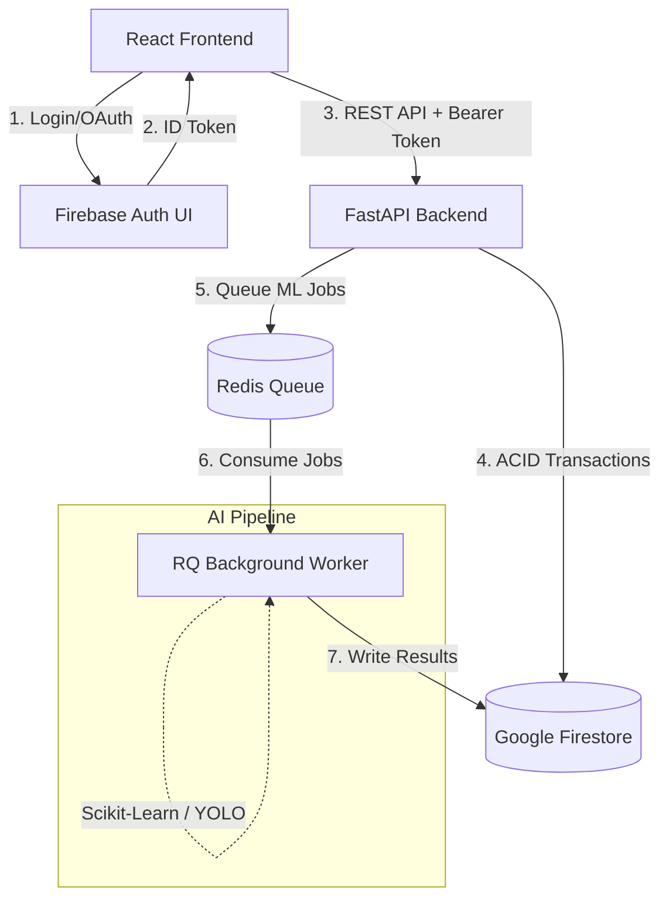

# FieldMind 🌾

An intelligent agricultural platform combining machine learning for crop and disease diagnostics with a robust, real-time marketplace for farm equipment and workforce hiring.

[](https://www.python.org/)
[](https://fastapi.tiangolo.com/)
[](https://react.dev/)
[](https://vitejs.dev/)
[](https://tailwindcss.com/)
[](https://firebase.google.com/)
[](https://www.docker.com/)

---

## Table of Contents
- [Overview](#overview)
- [Key Features](#key-features)
  - [Authentication](#authentication)
  - [Agriculture / AI](#agriculture--ai)
  - [Marketplace](#marketplace)
  - [Security](#security)
- [System Architecture](#system-architecture)
- [Project Structure](#project-structure)
- [Running Locally](#running-locally)

---

## Overview

FieldMind solves two critical challenges for modern farmers:
1. **Agronomic Intelligence:** Leveraging computer vision and machine learning to rapidly detect plant diseases and recommend optimal crops based on localized soil and weather conditions.
2. **Resource Allocation:** Providing a trusted, transparent, and transactional peer-to-peer marketplace for renting heavy farming equipment and hiring specialized agricultural workforces.

Built on a decoupled, highly-scalable architecture, FieldMind uses a React + Tailwind frontend that communicates via Firebase ID Tokens to a strict, authoritative FastAPI Python backend. Data and transactions are safely synchronized to Google Firestore.

---

## Key Features

### Authentication
- **Firebase Authentication:** Secure, native integration supporting Google Sign-In and Email/Password credentials.
- **Session Persistence:** State survives page refreshes and redirects seamlessly.
- **Mobile-Number Requirement:** Mandatory profile completion gate ensuring all marketplace actors are reachable.
- **Profile Synchronization:** Decentralized Auth syncing automatically to centralized Firestore user documents.

### Agriculture / AI
- **Disease Detection:** Asynchronous, queue-based (Redis/RQ) computer vision pipeline detecting diseases with severity scoring and bounding box localization.
- **Leaf Verification:** Pre-processing ONNX model to reject invalid/non-leaf imagery before expensive inference.
- **Crop Recommendation:** Scikit-learn predictive modeling fusing Soil NPK, pH, and localized weather metrics to rank optimal seasonal crops.
- **Diagnosis History:** Persistent user-tied history of all past AI diagnostics.
- **Offline ML Evaluation:** Developer/Admin dashboard for tracking prediction feedback and monitoring model drift.

### Marketplace
- **Equipment Marketplace:** Browse, filter, and discover farm machinery (tractors, harvesters, etc.).
- **Workforce Marketplace:** Directory of skilled agricultural laborers (harvesting, plowing, seeding).
- **Equipment & Worker Listing:** Empower farmers to monetize their idle assets and time.
- **Booking Lifecycle:** Full state machine (`Pending` -> `Approved`/`Rejected` -> `Completed` -> `Cancelled`).
- **Owner Dashboard:** Centralized UI for managing incoming requests and tracking outgoing bookings.
- **Resource Management:** Safe creation, editing, and deletion of listings.
- **Availability Validation:** Prevents double-booking of identical slots.

### Security
- **Firebase ID Token Verification:** API boundaries are strictly protected by cryptographically verifying bearer tokens against Google's public JWKs.
- **Backend Authorization:** True role and UID-based access control. The backend never trusts the frontend for `requesterId` or `ownerId`.
- **Ownership Checks:** Users can only mutate listings and approve bookings they explicitly own.
- **Self-Booking Prevention:** Owners cannot book their own equipment or hire their own workforce.
- **Backend Price Authority:** The backend recalculates and enforces transaction pricing, discarding tampered client-side rates.
- **Transactional Booking:** Firestore ACID transactions prevent race conditions during high-concurrency booking attempts.
- **Active-Booking Deletion Protection:** Owners cannot delete equipment or workers that have active (Pending/Approved) future commitments.

---

## System Architecture



---

## Project Structure

```text
fieldmind/
├── frontend/               # React, Vite, Tailwind CSS SPA
│   ├── src/
│   │   ├── components/     # Reusable UI (Marketplace forms, Navbars)
│   │   ├── hooks/          # Custom React hooks (useAuth, useLanguage)
│   │   ├── pages/          # Full page views (Dashboard, Marketplace, ML)
│   │   └── services/       # API clients (axios) & Firebase config
│   ├── index.html          # Vite entrypoint
│   └── package.json        # Node dependencies
├── backend/                # FastAPI application
│   ├── core/               # App configuration, logging, security middleware
│   ├── db/                 # Firebase Admin SDK initialization
│   ├── models/             # Pydantic schemas for request/response validation
│   ├── routers/            # API endpoints (marketplace, diagnosis, inference)
│   ├── services/           # Business logic & ML inference wrappers
│   ├── worker/             # RQ task definitions for async ML jobs
│   └── main.py             # ASGI application entrypoint
├── models/                 # Serialized ML assets (.onnx, .pkl)
├── tests/                  # Pytest integration and E2E suites
├── e2e_tests.py            # Comprehensive Python E2E verification script
├── docker-compose.yml      # Orchestration for Backend + Worker + Redis
└── requirements.txt        # Python dependencies
```

---

## Running Locally

### Prerequisites
- Node.js 18+
- Python 3.10+
- Redis (for async ML jobs)
- Firebase Project (with Auth & Firestore enabled)

### 1. Backend Setup

```bash
# Create a virtual environment
python -m venv .venv
source .venv/bin/activate

# Install dependencies
pip install -r requirements.txt

# Configure Firebase
# Place your Firebase Admin SDK service account key at the root:
# firebase_service_account.json

# Start the FastAPI server
uvicorn backend.main:app --reload --port 8002

# (Optional) Start the background ML worker
python -m backend.worker.inference_worker
```

### 2. Frontend Setup

```bash
cd frontend

# Install dependencies
npm install

# Configure environment variables
# Create a .env file based on .env.example with your Firebase Web Config

# Start the Vite dev server
npm run dev
```

### 3. Docker Compose (Alternative)

To run the entire backend stack (API, Redis, Worker) containerized:
```bash
docker-compose up --build
```

---

*FieldMind - Cultivating the future of intelligent farming.*
