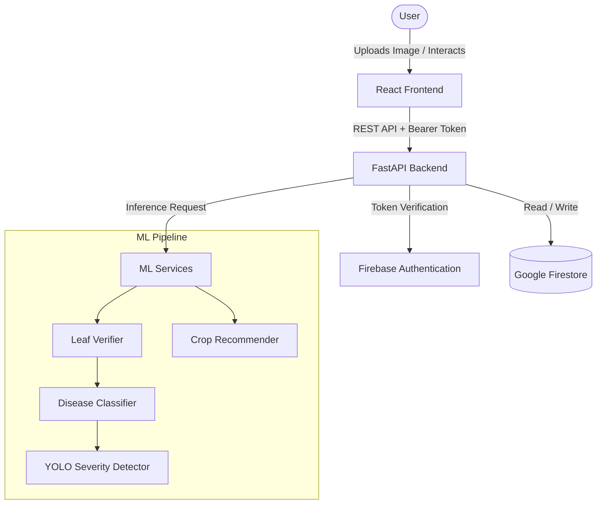
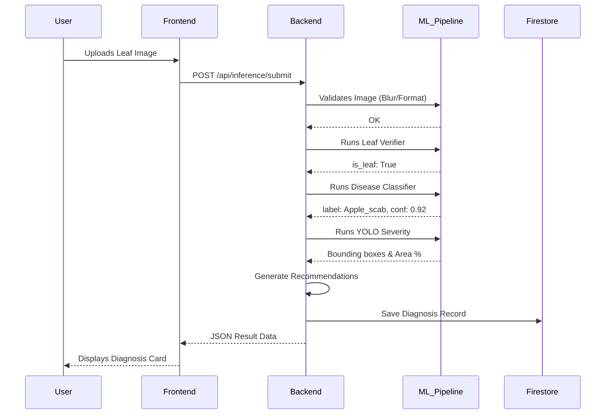
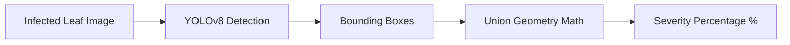
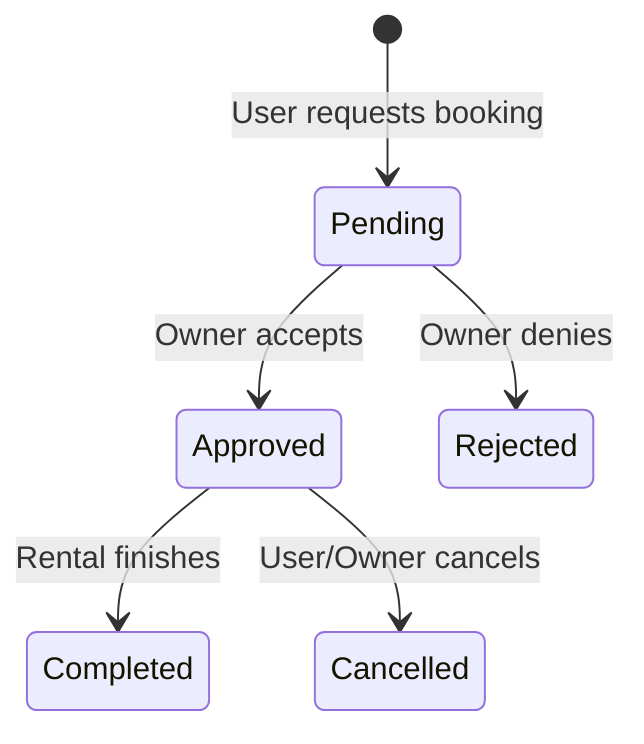

# 🌾 FieldMind

## AI-Powered Agricultural Assistance Platform

**FieldMind** is a B.Tech Computer Science final-year / resume project that demonstrates the end-to-end integration of Deep Learning, Computer Vision, and full-stack web development. It provides crop disease detection, intelligent crop recommendations, and a peer-to-peer agricultural marketplace built into a modern, responsive web application.

[](https://www.python.org/)
[](https://fastapi.tiangolo.com/)
[](https://react.dev/)
[](https://pytorch.org/)
[](https://onnxruntime.ai/)
[](https://ultralytics.com/)
[](https://firebase.google.com/)

> **Important Note:** This is an educational and demonstration project. It is **not** a production-ready AI or a clinically/agronomically validated system. The predictions made by the ML models are strictly for demonstration purposes.

---

## 📑 Table of Contents

1. [Project Overview](#1-project-overview)
2. [Why FieldMind?](#2-why-fieldmind)
3. [Core Features](#3-core-features)
4. [System Architecture](#4-system-architecture)
5. [Complete Disease Detection Flow](#5-complete-disease-detection-flow)
6. [ML Pipeline](#6-ml-pipeline)
7. [Leaf Verifier](#7-leaf-verifier)
8. [Disease Classifier](#8-disease-classifier)
9. [YOLO Severity Detection](#9-yolo-severity-detection)
10. [Recommendation Engine](#10-recommendation-engine)
11. [Crop Recommendation](#11-crop-recommendation)
12. [Diagnosis History](#12-diagnosis-history)
13. [Agricultural Marketplace](#13-agricultural-marketplace)
14. [Authentication](#14-authentication)
15. [Backend Architecture](#15-backend-architecture)
16. [Frontend Architecture](#16-frontend-architecture)
17. [Database Architecture](#17-database-architecture)
18. [API Architecture](#18-api-architecture)
19. [ML Evaluation Dashboard](#19-ml-evaluation-dashboard)
20. [Project Structure](#20-project-structure)
21. [Technology Stack](#21-technology-stack)
22. [Installation](#22-installation)
23. [Running Locally](#23-running-locally)
24. [API Examples](#24-api-examples)
25. [Testing](#25-testing)
26. [Known Limitations](#26-known-limitations)
27. [Security Considerations](#27-security-considerations)
28. [Future Improvements](#28-future-improvements)
29. [License](#29-license)

---

## 1. Project Overview

Farmers often face challenges in identifying crop diseases early, estimating their severity, and understanding the basic treatments available. Additionally, predicting which crops will thrive in specific soil and environmental conditions can be difficult, as is sourcing farming equipment and workforce.

**FieldMind** bridges these gaps by combining AI-driven diagnostic tools with an intuitive web platform. 

The standard interaction flow looks like this:

`USER INPUT` ➔ `REACT FRONTEND` ➔ `FASTAPI BACKEND` ➔ `ML INFERENCE` ➔ `RESULT PROCESSING` ➔ `FIRESTORE` ➔ `USER`

---

## 2. Why FieldMind?

FieldMind was built to demonstrate how multiple discrete Machine Learning models (classification, object detection, binary verification) can be orchestrated behind a robust REST API, and consumed by a modern front-end application with real-time cloud persistence. 

It tackles practical engineering challenges like:
- Running heavy PyTorch/YOLO inference effectively in a Python backend via ONNX.
- Validating inputs (rejecting non-leaf images) to save compute.
- Managing asynchronous, multi-stage ML pipelines.

---

## 3. Core Features

| Feature | Description | Technology |
|---------|-------------|------------|
| **Disease Detection** | Upload crop images and obtain sequential AI analysis | PyTorch / ONNX |
| **Leaf Verification** | Safety gate that filters obvious non-leaf/blurry inputs | MobileNetV3 (ONNX) |
| **Disease Classification**| Predicts the visual disease class | EfficientNet (ONNX) |
| **Severity Detection** | Detects affected regions via bounding boxes | YOLOv8 (ONNX) |
| **Recommendations** | Generates text-based treatment guidance based on disease | Backend logic |
| **Crop Recommendation** | Suggests crops from NPK & environmental inputs | Scikit-Learn |
| **Diagnosis History** | Persistently stores a user's previous diagnoses | Google Firestore |
| **Marketplace** | Peer-to-peer equipment and workforce listings & bookings | FastAPI + Firestore |
| **Authentication** | Secure Email/Password or Google Sign-In | Firebase Auth |
| **ML Dashboard** | Displays runtime evaluation metrics and statuses | React + FastAPI |

---

## 4. System Architecture



### Components
- **React Frontend**: A Single Page Application (SPA) providing the user interface, routing, and state management.
- **FastAPI Backend**: The core routing layer handling REST requests, input validation, and business logic.
- **ML Services**: Python-based inference engine utilizing ONNX Runtime for speed and portability.
- **Firestore**: A NoSQL cloud database storing user profiles, diagnosis history, and marketplace listings.

---

## 5. Complete Disease Detection Flow



---

## 6. ML Pipeline

FieldMind does not rely on a single "magic" model. It uses a sequenced, multi-stage ML pipeline to ensure efficiency and safety:

```text
INPUT IMAGE
      │
      ▼
┌─────────────────┐
│ Leaf Verifier   │  ➔ Fails if obvious non-leaf / human / sky
└────────┬────────┘
         │
         ▼
┌──────────────────────┐
│ Disease Classifier   │ ➔ Determines disease class (e.g., Tomato Blight)
└──────────┬───────────┘
           │
           ▼
┌──────────────────────┐
│ YOLO Severity Model  │ ➔ Detects visual symptom regions (bounding boxes)
└──────────┬───────────┘
           │
           ▼
┌──────────────────────┐
│ Recommendation Logic │ ➔ Maps disease label to treatment strategies
└──────────────────────┘
```

By separating concerns, the backend can reject bad inputs early (saving compute) and independently upgrade individual models.

---

## 7. Leaf Verifier

- **Purpose:** Acts as a binary safety gate. It verifies whether an uploaded image actually contains a leaf before passing it to the heavy disease classifier.
- **Tech:** A lightweight MobileNetV3-Small exported to ONNX.
- **Features:** Detects blur and obvious non-leaf objects (humans, skies, objects).
- **Limitation:** It is a lightweight gate, not a perfect agricultural segmentation model. It can occasionally pass complex backgrounds or reject very darkly lit leaves (domain shift).

---

## 8. Disease Classifier

- **Purpose:** Classifies the specific disease present on the leaf.
- **Tech:** EfficientNet architecture exported to ONNX.
- **Flow:** Accepts cropped/resized tensors and outputs a probability distribution over 20+ disease classes.
- **Limitation (Crop Identity):** The model predicts a joint label like `tomato_septoria_leaf_spot`. Because the crop name is baked into the label, if you upload a potato leaf with visually similar symptoms, the model may output a tomato-related disease. The UI mitigates this by classifying results as a "Possible Disease" rather than absolute ground truth.

---

## 9. YOLO Severity Detection

- **Purpose:** Identifies exactly *where* the disease symptoms are located on the leaf.
- **Tech:** YOLOv8 (You Only Look Once) exported to ONNX.
- **Flow:** Detects bounding boxes around symptomatic regions. The backend geometrically unions these bounding boxes to estimate the affected surface area.



- **Limitation:** The severity percentage is an approximation. Bounding boxes are rectangular and inherently overestimate the true pixel-area of irregular disease spots.

---

## 10. Recommendation Engine

- **Purpose:** Translates the raw ML disease label into human-readable, actionable advice.
- **Flow:** Uses a rule-based dictionary lookup (`backend/services/recommendation_reason_service.py`) to provide treatment steps (e.g., "Apply copper-based fungicide", "Improve drainage").
- **Limitation:** These recommendations are strictly educational and rely on static mappings. They do not replace professional agronomic consultation.

---

## 11. Crop Recommendation

- **Purpose:** Recommends the most suitable crop to plant given specific environmental data.
- **Inputs:** Soil metrics (Nitrogen, Phosphorous, Potassium, pH) and Weather metrics (Temperature, Humidity, Rainfall).
- **Tech:** A Scikit-Learn `RandomForest` / `DecisionTree` model saved as a `.pkl` file.
- **Flow:** Takes a flat array of environmental floats and outputs a ranked list of recommended crops.

---

## 12. Diagnosis History

- **Flow:** Once an inference successfully completes, the JSON payload (including disease label, confidence, severity, and recommendations) is written to a Google Firestore collection keyed to the authenticated user's ID.
- **Value:** Allows users to track disease progression over time or reference past treatments without re-running the ML pipeline.

---

## 13. Agricultural Marketplace

FieldMind includes a peer-to-peer marketplace where users can rent farm equipment or hire agricultural laborers.

- **Listings:** Users can create and view equipment or worker profiles.
- **Booking Lifecycle:**
  


- **Persistence:** Fully managed via FastAPI CRUD endpoints interacting with Firestore.

---

## 14. Authentication

Authentication is handled securely via **Firebase Authentication**.

- **Methods Supported:** Google Sign-In and standard Email/Password.
- **Backend Flow:** The React frontend receives a JWT Bearer token from Firebase upon login. Every secured FastAPI request includes this token in the `Authorization` header.
- **Validation:** FastAPI uses the Firebase Admin SDK to decode and verify the JWT signature before allowing access to user-specific Firestore documents or ML endpoints.

---

## 15. Backend Architecture

The FastAPI backend follows a clean, modular structure:

```
backend/
├── main.py              # ASGI entry point and middleware configuration
├── core/                # Configuration (settings.py) and constants
├── db/                  # Firebase Admin SDK initialization (firebase.py)
├── models/              # Pydantic schemas and .onnx/.pkl ML model weights
├── routers/             # API route handlers (e.g., diagnosis, marketplace, health)
├── services/            # Business logic and ML inference wrappers
└── worker/              # Background RQ worker tasks for async inference
```

---

## 16. Frontend Architecture

The React frontend utilizes Vite for fast builds and TailwindCSS for styling.

```
frontend/
├── index.html
├── package.json
└── src/
    ├── App.jsx          # React Router configuration
    ├── main.jsx         # DOM mounting
    ├── components/      # Reusable UI (Navbar, Sidebar, UploadBox, Timeline)
    ├── hooks/           # Custom hooks (useAuth, useLanguage)
    ├── pages/           # Route views (Dashboard, DiseaseDetection, Marketplace)
    └── services/        # Axios API clients and Firebase client config
```

---

## 17. Database Architecture

Google Firestore is used as a highly scalable NoSQL document database.

```text
Firestore Root
│
├── users (collection)
│   └── {user_id} ➔ Profile data, roles
│
├── diagnoses (collection)
│   └── {diagnosis_id} ➔ user_id, disease_label, severity, timestamp
│
├── equipment (collection)
│   └── {equipment_id} ➔ owner_id, name, price, status
│
├── workers (collection)
│   └── {worker_id} ➔ name, skills, hourly_rate
│
└── bookings (collection)
    └── {booking_id} ➔ requester_id, target_id, status (Pending/Approved)
```

---

## 18. API Architecture

| Method | Endpoint | Purpose | Auth Required |
|--------|----------|---------|---------------|
| `GET` | `/ready` | Deep health check (ML models, DB) | No |
| `POST` | `/api/inference/submit` | Upload image for ML pipeline analysis | Yes |
| `POST` | `/api/marketplace/equipment` | Create a new equipment listing | Yes |
| `GET` | `/api/marketplace/bookings` | Fetch user's booking history | Yes |
| `GET` | `/api/ml/dashboard` | Fetch available ML offline evaluation metrics | No |

---

## 19. ML Evaluation Dashboard

The `/ml-dashboard` route displays offline evaluation metrics for the frozen ML models.

- **Integrity:** The repository currently contains a valid test dataset of 10 images explicitly for the **Leaf Verifier**. The dashboard calculates and displays *real* metrics (Accuracy, Precision, Recall) based on this ground-truth data.
- **Unavailable Data:** The Disease Classifier, YOLO Detector, and Crop Recommender lack legitimate ground-truth evaluation datasets in this repository. To maintain integrity, the dashboard explicitly displays **"Evaluation Dataset Unavailable"** for these models rather than fabricating 0% metrics or spoofing fake accuracy numbers.

---

## 20. Project Structure

```
fieldmind/
├── README.md                  # This file
├── requirements.txt           # Python dependencies
├── start.sh                   # One-click startup script
├── docker-compose.yml         # Container definitions
│
├── backend/                   # FastAPI application
│   ├── main.py                
│   ├── core/                  
│   ├── db/                    
│   ├── models/                # ML weights (.onnx, .pkl)
│   ├── routers/               
│   ├── services/              
│   └── worker/                
│
├── frontend/                  # React Application
│   ├── package.json
│   └── src/                   
│
├── tests/                     # Test suite
│   ├── api/                   # API endpoint tests
│   ├── ml/                    # ML pipeline tests
│   └── unit/                  # Unit tests
│
└── evaluation/                # Offline ML evaluation pipeline
    ├── evaluate.py
    ├── evaluators/
    └── results/               # Generated metric JSONs
```

---

## 21. Technology Stack

| Category | Technologies |
|----------|-------------|
| **Frontend** | React 19, Vite, Tailwind CSS, Framer Motion, Axios |
| **Backend** | Python 3.10+, FastAPI, Pydantic, Uvicorn |
| **AI / ML** | PyTorch, ONNX Runtime, Ultralytics YOLOv8, Scikit-Learn, OpenCV, Pillow |
| **Database** | Google Firestore |
| **Auth** | Firebase Authentication |
| **DevOps / QA** | Docker, Pytest, Git |

---

## 22. Installation

### Prerequisites
- Python 3.10+
- Node.js 18+
- A Firebase project with **Authentication** and **Firestore** enabled.
- A Firebase Admin SDK JSON file (`firebase_service_account.json`).

### 1. Clone & Setup Backend

```bash
git clone https://github.com/your-username/fieldmind.git
cd fieldmind

# Create and activate virtual environment
python3 -m venv .venv
source .venv/bin/activate  # Windows: .venv\Scripts\activate

# Install Python dependencies
pip install -r requirements.txt

# Place your Firebase Admin SDK key in the root directory
# Ensure it is named 'firebase_service_account.json'
```

### 2. Setup Frontend

```bash
cd frontend

# Install Node dependencies
npm install

# Configure Firebase Web credentials
cp ../.env.example .env
# Edit .env and provide your VITE_FIREBASE_* credentials from the Firebase Console
```

---

## 23. Running Locally

### The Easy Way (One-Command Start)

You can launch both the backend and frontend simultaneously using the provided bash script:

```bash
./start.sh
```

- **Backend** will run on: `http://localhost:8002`
- **Frontend** will run on: `http://localhost:5174`

*Press `Ctrl+C` in the terminal to cleanly shut down both servers.*

### Docker Compose
Alternatively, to run the stack via containers (requires Docker):
```bash
docker-compose up --build
```

---

## 24. API Examples

**Health Check:**
```bash
curl -s http://localhost:8002/ready
```
*Expected Response:*
```json
{"status":"ready","checks":{"ml_models":"ready","leaf_verifier":"ready","database":"ready","redis":"not_configured"}}
```

**Testing Inference (Assuming Auth is bypassed for local test via code modification):**
```bash
curl -X POST \
  -F "file=@tests/ml/test_images/A_clear_leaf.jpg" \
  http://localhost:8002/api/inference/submit
```
*Expected Response:*
```json
{"job_id":"a1d2...","status":"completed","request_id":"5112..."}
```

---

## 25. Testing

The project is heavily tested using `pytest`.

To verify compilation and run the test suite:

```bash
# Compile Python files to catch syntax errors
./.venv/bin/python -m compileall backend/ tests/ evaluation/

# Run the test suite
./.venv/bin/pytest tests/
```

**Current verified status:** `97 passed`

---

## 26. Known Limitations

This project embraces transparency regarding its limitations:

1. **Educational/Demonstration Purpose Only.** This is NOT a production-ready AI or agronomically validated system.
2. **Crop Identity Confusion.** The disease classifier is trained on visual disease symptoms. It may confuse visually similar diseases across different crops (e.g., mislabeling potato blight as tomato blight).
3. **Domain Shift.** Models trained on laboratory-style datasets (like PlantVillage) often suffer a drop in accuracy when evaluating real-world smartphone photos with complex lighting and backgrounds.
4. **Leaf Verifier is a Gate, not a God.** It filters obvious errors (humans, skies, objects) but can occasionally be tricked by highly complex foliage backgrounds.
5. **Severity is an Approximation.** The YOLO model outputs bounding boxes. Geometric area calculations of boxes overestimate the true organic surface area of disease spots.
6. **No Auto-Retraining.** The ML models are frozen. Feedback is stored but does not actively retrain the ONNX files.

---

## 27. Security Considerations

While not enterprise-grade, FieldMind implements several practical security layers:
- **JWT Verification:** Backend routes require Firebase Bearer tokens validated via the Admin SDK.
- **Data Ownership:** Firestore update/delete operations verify that the requester is the owner of the document.
- **Pydantic Validation:** All incoming JSON payloads are strictly validated for type and constraints before processing.
- **No Path Traversal:** Image uploads are processed in memory (via BytesIO/Pillow) and never arbitrarily saved to the server disk.

---

## 28. Future Improvements

- Introduce a segmentation model (like Mask R-CNN or YOLO-Seg) to replace bounding boxes for highly accurate severity percentage calculations.
- Expand the ML evaluation dataset with thousands of real-world field images to rigorously benchmark the domain shift.
- Separate the "Crop Identifier" from the "Disease Classifier" into two distinct ML models to solve crop-identity confusion.
- Build a React Native mobile application for offline field use.

---

## 29. License

This project is licensed under the MIT License.
