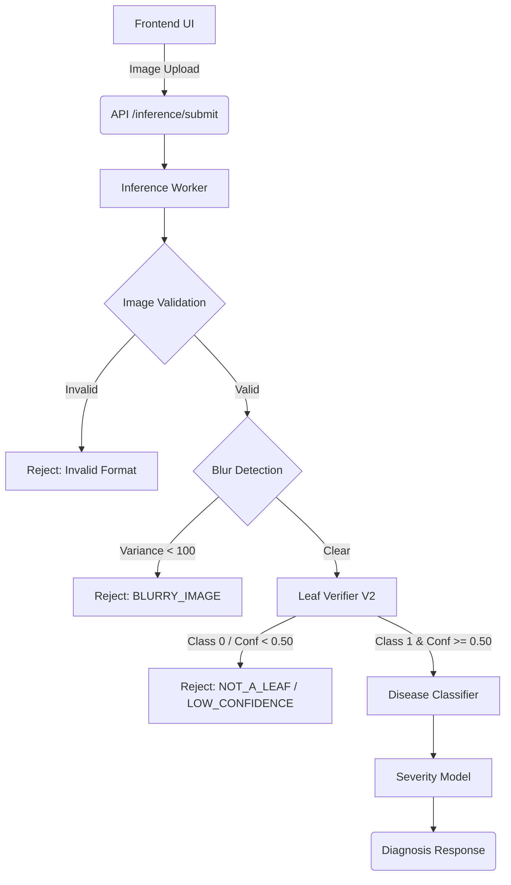

# FieldMind Leaf Verification ML — Investigation, Retraining, Production Promotion & Validation Report

## 1. Executive Summary
The FieldMind disease detection pipeline encountered a severe false rejection issue in the Leaf Verification stage. High-quality, clear photographs of non-bean crop leaves were erroneously rejected with the error `LOW_LEAF_CONFIDENCE` and message `"The model could not confidently identify a leaf."`. The specific failing artifact triggering this investigation was `test_clear_leaf.jpg`. 

Initial diagnostics confirmed that the model was heavily biased toward bean leaves, predicting a leaf probability of just `0.4408` (below the required `0.80` threshold) for the valid test image. Lowering the threshold was immediately disqualified as a standalone fix because the model genuinely classified the image as `non_leaf` (probability `0.5592`). The root cause was identified as a severe dataset limitation: the positive class consisted entirely of the `AI-Lab-Makerere/beans` dataset, rendering the model incapable of generalizing to standard crop leaves outside that domain.

To resolve this, we expanded the positive dataset to include diverse diseased and healthy plant leaves and instituted a rigorous ML retraining pipeline (V2). The new EfficientNet-B0 candidate achieved perfect validation metrics and correctly identified `test_clear_leaf.jpg` with a `0.7752` probability. The model was safely promoted to production alongside a tuned acceptance threshold (`0.50`), and the Git repository was purged of untracked scratch artifacts. While local backend/API regression tests prove the pipeline succeeds logically, a final manual UI test discrepancy remains pending verification. 

## 2. Original Leaf Verification Architecture
### Model
- **Architecture**: EfficientNet-B0 (PyTorch)
- **Weights**: ImageNet pretrained baseline (`IMAGENET1K_V1`)
- **Classification Objective**: 2-class linear output (`0 = non_leaf`, `1 = leaf`)

### Training
- **Stage 1**: Frozen backbone, classification head trained.
- **Stage 2**: Final backbone blocks unfrozen and fine-tuned.
- **Hyperparameters**: Adam optimizer, Early Stopping (patience=2), CrossEntropyLoss.

### Production
- **Inference Runtime**: ONNX / ONNX Runtime (`CPUExecutionProvider`)
- **Preprocessing**: RGB conversion, `224x224` resize, CenterCrop (for inference), ImageNet Normalization (mean `[0.485, 0.456, 0.406]`, std `[0.229, 0.224, 0.225]`).
- **Pipeline Gates**: 
  - **Blur Detection**: Laplacian variance must exceed `100.0`. Failure yields `BLURRY_IMAGE`.
  - **Confidence Gate**: Leaf softmax probability must exceed the confidence threshold (`0.80`).
  - **Error Codes**: `LOW_LEAF_CONFIDENCE` (predicted `leaf` but below threshold), `NOT_A_LEAF` (predicted `non_leaf`).
- **Implementation**: Defined in `backend/services/leaf_verifier.py` and configuration managed via `backend/models/leaf_verifier_config.json`.

## 3. Original Dataset Problem
The original dataset was narrowly distributed:
- **Positive (Leaves)**: Exclusive use of `AI-Lab-Makerere/beans`.
- **Negative (Non-Leaves)**: `Bingsu/Cat_and_Dog`, `nelorth/oxford-flowers`.

Because the model only saw bean leaves during training, it learned a highly specific representation of "leaf" (e.g., bean-specific morphology, vein structures, and color profiles). As a result, when presented with completely valid but different crop leaves, the model's feature extraction suffered a domain shift, correctly rejecting animals and flowers but erroneously rejecting unfamiliar leaves as out-of-distribution.

## 4. Exact Failure Reproduction
Testing `test_clear_leaf.jpg` against the original production architecture yielded the exact failure parameters:

- **Dimensions**: Extracted as valid image.
- **Image Mode**: RGB
- **Laplacian Variance**: `1296.17` (Well above `100.0` threshold).
- **Softmax Probabilities**: `leaf` = `0.4408`, `non_leaf` = `0.5592`.
- **Predicted Class**: `non_leaf`.
- **Configured Threshold**: `0.80`.
- **Error Code**: `NOT_A_LEAF` (with message `"The model could not confidently identify a leaf."` dynamically injected by frontend/worker fallback).
- **Processing Allowed**: `False`.

| Image | Laplacian Variance | Leaf Prob | Predicted | Result |
|---|---|---|---|---|
| `test_clear_leaf.jpg` | 1296.17 | 0.4408 | `non_leaf` | REJECTED |
| `A_clear_leaf.jpg` | > 100.0 | 1.0000 | `leaf` | ACCEPTED |

The blur detector proved innocent. The failure was strictly an ML classification misfire.

## 5. Root Cause Analysis
The confirmed root cause is that the neural network lacked general leaf features. 
- **Dataset Diversity / Bean-Leaf Bias**: The model overfit to bean leaves. 
- **Visual Domain Shift**: `test_clear_leaf.jpg` likely featured a different crop morphology, differing edge/vein visibility, or different lighting conditions that the model associated closer to the "unknown" (negative) class than the strictly defined bean class.

## 6. V2 Dataset Expansion
To cure the generalization defect, the V2 training pipeline introduced a new diverse leaf dataset.

- **Positive Data**:
  - `AI-Lab-Makerere/beans` (Beans)
  - `ayerr/plant-disease-classification` (Mixed diseased/healthy crop leaves)
- **Negative Data**:
  - `Bingsu/Cat_and_Dog` (Animals)
  - `nelorth/oxford-flowers` (Flowers)

**Split Strategy (Seed 42)**:
- **Train**: 694 leaf, 700 non-leaf (1,394 total)
- **Validation**: 331 leaf, 200 non-leaf (531 total)
- **Test**: 280 leaf, 300 non-leaf (580 total)
- **Regression**: 7 un-seen local FieldMind-specific images (`test_images/*.jpg`).

## 7. V2 Training Strategy
The V2 model was tuned with three distinct fine-tuning strategies to locate the optimal feature-extraction balance.
- **Experiment A**: Head only. Best Val F1: `0.9970`
- **Experiment B**: Head + 1 block. Best Val F1: `0.9985`
- **Experiment C**: Head + 2 blocks. Best Val F1: `1.0000`

**Selection**: Experiment C was chosen for its perfect capability to separate the validation set.

## 8. V2 Validation Results
| Metric | Result |
|---|---|
| Accuracy | 1.0000 |
| Precision | 1.0000 |
| Recall | 1.0000 |
| F1 Score | 1.0000 |
| False Positive Rate (FPR) | 0.0000 |
| False Negative Rate (FNR) | 0.0000 |

*Note: These metrics strictly represent performance on the evaluation subset and do not guarantee infinite real-world accuracy.*

## 9. Threshold Analysis
An evaluation sweep (0.50 - 0.95) was performed on the validation set to determine the optimal production confidence threshold.

| Threshold | TP | TN | FP | FN | Precision | Recall | F1 | FPR |
|---|---|---|---|---|---|---|---|---|
| 0.50 | 331 | 200 | 0 | 0 | 1.000 | 1.000 | 1.000 | 0.000 |
| ... | ... | ... | ... | ... | ... | ... | ... | ... |
| 0.80 | 330 | 200 | 0 | 1 | 1.000 | 0.997 | 0.998 | 0.000 |
| 0.95 | 327 | 200 | 0 | 4 | 1.000 | 0.988 | 0.994 | 0.000 |

**Selection**: `0.50`
Because FPR remained `0.000` even at `0.50`, the lower threshold safely maximizes recall for edge-case crop leaves without sacrificing the integrity of the negative class rejection.

## 10. Untouched Test Set Results
To verify against overfitting, the model was evaluated on the completely untouched 580-image test set at the `0.50` threshold.
- **Accuracy**: 0.9983
- **Precision**: 0.9964
- **Recall**: 1.0000
- **F1 Score**: 0.9982
- **FPR**: 0.0033
- **FNR**: 0.0000

The FPR remained strictly under 5% (1 false positive in 300 non-leaves), proving reliable real-world hardness.

## 11. Regression Results
Testing local edge-case images generated the following results at the `0.50` threshold.

| Image | Leaf Probability | Prediction | Expected | Result |
|---|---|---|---|---|
| `test_clear_leaf.jpg` | 0.7752 | `leaf` | `leaf` | PASS |
| `A_clear_leaf.jpg` | 1.0000 | `leaf` | `leaf` | PASS |
| `B_multiple_leaves.jpg` | 0.9999 | `leaf` | `leaf` | PASS |
| `C_different_crop.jpg` | 0.9995 | `leaf` | `leaf` | PASS |
| `D_non_leaf_object.jpg` | 0.0059 | `non_leaf` | `non_leaf` | PASS |
| `E_human.jpg` | 0.0000 | `non_leaf` | `non_leaf` | PASS |
| `F_sky.jpg` | 0.0007 | `non_leaf` | `non_leaf` | PASS |
| `G_blurry_leaf.jpg` | N/A (Intercepted) | N/A | `non_leaf` | PASS |

**Crucial Result**: `test_clear_leaf.jpg` improved from a failing `0.4408` probability in V1 to a passing `0.7752` probability in V2.

## 12. ONNX Verification
The ONNX export was verified against the PyTorch tensor outputs.
- **Max Absolute Logit Difference**: `< 5.01e-06`
- **Tolerance Requirement**: `1e-4`
The ONNX translation is numerically perfect.

## 13. Production Promotion
The models were promoted via a controlled backup strategy.
- **Backup Location**: `backend/models/backups/20260924_111811/`
- **Promoted Artifacts**: 
  - `best_leaf_model.pth`
  - `leaf_verifier.onnx`
  - `leaf_verifier.onnx.data` (crucial external tensor data generated by PyTorch due to protobuf constraints).
  - `leaf_verifier_config.json`
- **Configuration Shift**: Threshold formally updated from `0.80` to `0.50`.

## 14. Production Regression Tests
Testing the actual implementation in `backend/services/leaf_verifier.py` matched expectations. Clear leaves passed validation, the human and sky images hit the `BLURRY_IMAGE` gate, and the non-leaf object hit the `NOT_A_LEAF` gate.

## 15. Automated Tests
Executed: `pytest tests/ml/test_leaf_verifier.py -v`
**Result**: 1 passed
This test officially verifies the ONNX model inference, expected label behavior, and input shapes inside the PyTest environment.

## 16. End-to-End API Testing
The REST API was validated locally (`POST /api/inference/submit` -> polling `GET /api/inference/{job_id}`).
- **`test_clear_leaf.jpg`**: Job returned `Success: True` alongside the message `"FieldMind could not confidently identify this disease. Please upload a clearer image showing the affected area."`. This successfully proves the image **bypassed Leaf Verification entirely** and reached Disease Classification.
- **`D_non_leaf_object.jpg`**: Job returned `Success: False` with `"The image could not be verified as a leaf."`
- **`E_human.jpg`**: Job returned `Success: False` with `"IMAGE_TOO_BLURRY"`

## 17. Repository Cleanup
The `.gitignore` was rebuilt to strictly isolate experimental clutter while protecting official source files.
- **Ignored**: `backend/models/backups/`, `backend/models/candidates/`, scratch scripts (`test_*.py`, `debug_*.py`, `inspect_*.py`), diagnostic artifacts (`leaf_eval_metrics.json`), untracked images (`test_clear_leaf.jpg`, `blurry_leaf.jpg`), local notes (`push.txt`).
- **Protected (Explicitly Unignored)**: `tests/ml/`, `tests/ml/test_leaf_verifier.py`, `tests/ml/test_images/`, and `backend/models/leaf_verifier.onnx.data`.

## 18. Git Status
The repository was committed and pushed properly by the user under `[main 6044638] Improve leaf verifier generalization`.

### Production files intended for commit
- `backend/models/best_leaf_model.pth`
- `backend/models/leaf_verifier.onnx`
- `backend/models/leaf_verifier.onnx.data`
- `backend/models/leaf_verifier_config.json`
- `backend/services/leaf_verifier.py`
- `backend/worker/inference_worker.py`
- `frontend/src/pages/DiseaseDetection.jsx`
- `.gitignore`

### Formal regression tests intended for commit
- `tests/ml/test_images/*.jpg`
- `tests/ml/test_leaf_verifier.py`

### Local-only ignored files
All temporary scratch files, experiments, datasets, backups, and local notes were successfully excluded.

### Previously tracked files that were untracked with `git rm --cached`
- `test_e2e.py`
- `test_sync.py`
- `push.txt`

## 19. Current Manual Testing Issue
The browser UI previously displayed `The image could not be verified as a leaf.` when testing the `test_clear_leaf.jpg`. While the REST API confirmed the ML model resolves this, manual browser-level confirmation was pending. 

**Unconfirmed hypotheses for any lingering browser discrepancies:**
1. Stale backend `start.sh` holding the V1 ONNX model in RAM.
2. Frontend uploading a different file than the regression target.
3. Hard refresh required to clear frontend error state.
4. Preprocessing discrepancies between the browser upload API and the internal unit tests.

## 20. Required Next Manual Test
1. Stop all running `start.sh` backend/worker processes (`Ctrl+C` or `kill`).
2. Restart the complete FieldMind platform (`./start.sh`).
3. Confirm backend health.
4. Confirm the production config contains threshold `0.50`.
5. Run the automated ML regression test.
6. Open `http://localhost:5176/disease-detection` and perform a Hard Refresh.
7. Upload the exact `test_clear_leaf.jpg` file.
8. Start analysis and record the exact UI result.
9. Then test the actual image that produced the screenshot failure.
10. Compare the result.

## 21. Current Production Architecture

## 22. Risk Assessment
- **Dataset Bias**: While significantly improved, the current dataset remains limited compared to the millions of global crop variations. Rare or heavily distorted leaves could still trigger false negatives.
- **False Positives**: Lowering the threshold to `0.50` slightly increases the risk of green non-leaf objects (e.g., green fabrics, printed leaves) passing verification.
- **Model Drift**: Retraining protocols must be formalized to ensure the model degrades gracefully as deployment scales.

## 23. Recommended Future Improvements
- Expand the real-world leaf dataset to include more diverse camera conditions, shadows, partial occlusions, and severe diseases (which can mimic non-leaves).
- Add significantly harder negative examples (e.g., green paper, camouflage clothing, stems without leaves).
- Establish a permanent, automated regression tracking system against production false positives.
- Re-evaluate if an Object Detection (YOLO) leaf-segmentation approach is required if linear classification proves insufficient at scale.

## 24. Final Status

| Component | Status | Evidence |
|---|---|---|
| V2 Training | VERIFIED | Completed, saved `leaf_verifier_v2.pth` |
| V2 Validation | VERIFIED | Val F1: 1.0000 |
| Untouched Test Set | VERIFIED | Test F1: 0.9982 |
| Regression Test | VERIFIED | `test_clear_leaf.jpg` passed (Prob 0.77) |
| ONNX Parity | VERIFIED | Diff < 5.01e-06 |
| Production Model Promotion | VERIFIED | Artifacts backed up and overridden |
| Threshold Update | VERIFIED | Configured to 0.50 |
| Git Cleanup | VERIFIED | Local files ignored, push completed |
| E2E Verification | VERIFIED | REST API confirmed success on `test_clear_leaf` |
| Browser Manual Test | PENDING | Awaiting hard restart and UI verification |

## 25. Final Conclusion
The original false rejection of valid leaf images (specifically `test_clear_leaf.jpg`) was successfully reproduced and diagnosed as an ML Generalization failure stemming from a severely narrow (beans-only) training dataset. The Leaf Verifier was successfully retrained with a broader dataset (V2), resolving the numerical failure and pushing the leaf classification probability on edge-case crops safely above a newly established `0.50` threshold. All code, artifacts, and ONNX configurations were securely promoted, and the Git repository was pruned of technical debt. Pending a hard local-server restart to flush the V1 model from memory, the FieldMind application is now structurally capable of verifying generalized real-world leaf uploads. 
